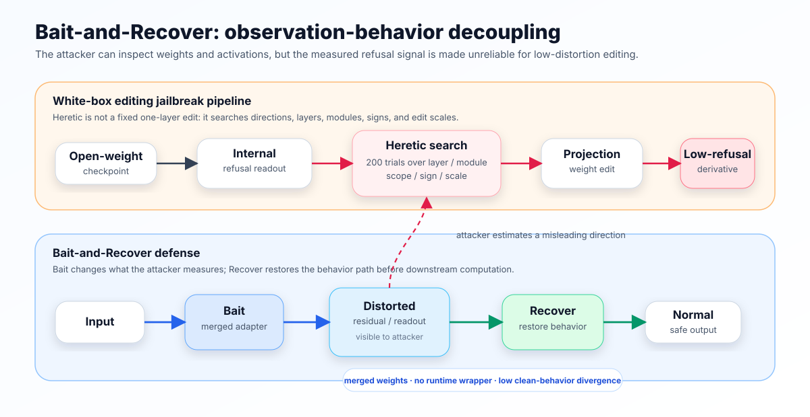

<p align="center">
  <a href="#english">English</a> | <a href="#zh-cn">简体中文</a>
</p>

<a id="english"></a>

# Bait-and-Recover

**Protecting open-weight LLM safety alignment against refusal-direction parameter editing.**

**Accepted at AACL-IJCNLP 2026 Main.**

Paper: [PDF](paper/Bait-and-Recover.pdf) · [arXiv:2609.05794](https://arxiv.org/abs/2609.05794)

<p>
  <a href="https://arxiv.org/abs/2609.05794"></a>
  <a href="https://github.com/SparkShieldLab/bait-and-recover"></a>
  <a href="https://sai.xingdun-ai.com/home"></a>
  <a href="https://open.weixin.qq.com/qr/code?username=gh_89d544e1b8aa"></a>
</p>

Some white-box jailbreaks do not fine-tune the model. Instead, they:

1. measure internal directions associated with refusal across model layers,
2. search over layer/module/sign/scale choices and edit projection weights to suppress those directions,
3. obtain a model that refuses much less while largely preserving normal behavior.

Heretic is therefore not a single-layer manual edit. In the public evaluation packaged here, it runs a 200-trial automated search over per-layer and global direction scopes, target modules (`attn.o_proj` and `mlp.down_proj`), edit signs, edit scales, and layer choices/aggregations. For Qwen3-8B, the search spans 36 transformer layers, i.e., 72 candidate projection modules across attention-output and MLP-down projections. For Gemma-3-12B-it, it spans 48 layers and 96 such modules. The strongest low-KL edits can emerge from different readout/edit configurations, which makes the defense problem much harder than blocking one fixed layer or one fixed refusal direction.

Bait-and-Recover breaks this measurement-to-edit pipeline. Its core idea is **observation-behavior decoupling**: what the attacker observes is no longer the same signal that actually controls the model's downstream behavior. The method is designed for this search-based setting: it does not defend only one known edit location, but makes the measurement surface unreliable for attack-guided editing.

<p align="center">
  
</p>

The model behaves normally; the attacker measures the wrong direction. More precisely, the measured direction becomes a poor proxy for identifying effective low-distortion edits.

Bait-and-Recover does not rely on hiding the bait or recovery parameters. It targets automated white-box attacks that infer editing directions from internal activations and use those measurements to guide low-distortion parameter edits.

## Key result

Under a 200-trial Heretic search with KL <= 0.10, we report the lowest-refusal edit found by the attacker:

| Model | Clean checkpoint<br>min. refusal @ KL <= 0.10 ↑ | After Bait-and-Recover<br>min. refusal @ KL <= 0.10 ↑ | Improvement |
|---|---:|---:|---:|
| Qwen3-8B | 11% | 60% | +49 pp |
| Gemma-3-12B-it | 3% | 83% | +80 pp |

Higher minimum refusal is better: it means the attacker's best low-distortion edit still leaves more refusal behavior intact. Here, `pp` means percentage points.

Clean-behavior KL measures output-distribution divergence between the original and defended checkpoints on benign prompts; lower is better. The full table below reports this divergence alongside attack results, showing that Bait-and-Recover raises the refusal floor while limiting clean-behavior divergence.

## Main validation table

The table reports the minimum refusal rate found by a 200-trial Heretic search under different KL budgets. Clean-baseline rows show how far Heretic can reduce refusal on the original checkpoint. Bait-and-Recover rows show the defended checkpoint under the public recipe.

| Model | Setting | Bait layers (final) | KL<=0.05 | KL<=0.10 | KL<=0.20 | KL<=1.0 | Clean-behavior KL |
|---|---|---:|---:|---:|---:|---:|---:|
| Qwen3-8B | Clean baseline | -- | 36% | 11% | 11% | 8% | -- |
| Qwen3-8B | Bait-and-Recover | 14-34 | 79% | 60% | 44% | 43% | 0.0099 |
| Gemma-3-12B-it | Clean baseline | -- | 12% | 3% | 2% | 0% | -- |
| Gemma-3-12B-it | Bait-and-Recover | 18-38 | 83% | 83% | 83% | 79% | 0.0850 |

Bait layers report the final union across the two training phases. Each phase trains alternating parity subsets: Qwen3-8B uses Phase 1 = 15,17,...,33 and Phase 2 = 14,16,...,34; Gemma-3-12B-it uses Phase 1 = 18,20,...,38 and Phase 2 = 19,21,...,37.

These validation runs show the behavior Bait-and-Recover is designed to induce: low-distortion refusal-direction editing sharply lowers refusal on clean checkpoints, while defended checkpoints retain a substantially higher refusal floor while limiting clean-behavior divergence.

## Utility snapshot

For the two highlighted models, paired clean/defended evaluations show little movement on MMLU-Redux and IFEval. Scores are accuracies; higher is better.

| Model | MMLU-Redux clean | MMLU-Redux defended | Δ | IFEval clean | IFEval defended | Δ |
|---|---:|---:|---:|---:|---:|---:|
| Qwen3-8B | 77.82% | 77.61% | -0.21 pp | 83.73% | 83.73% | +0.00 pp |
| Gemma-3-12B-it | 75.28% | 75.06% | -0.22 pp | 80.59% | 80.96% | +0.37 pp |

These paired checks complement the clean-behavior KL diagnostic: Bait-and-Recover is intended to raise the cost of low-distortion uncensoring without materially changing standard benchmark behavior.

## Threat model

Bait-and-Recover targets automated white-box attacks that estimate refusal directions from internal activations and use them to guide low-distortion parameter editing. The evaluated attacker is adaptive within the Heretic search space rather than a fixed one-layer edit. The defense assumes the released weights and activations are visible to the attacker; it does not depend on secret parameters or hidden inference-time logic.

Bait-and-Recover is scoped to this attack path. It does not try to prevent every possible weight modification, malicious fine-tuning run, or migration to an undefended checkpoint. Its practical value is making a released checkpoint harder to uncensor automatically and with low behavioral distortion.

## Why Bait-and-Recover?

- **Observation-behavior decoupling.** The attacker measures a distorted refusal representation, while the model's downstream computation is restored.
- **Weight-level protection.** The defense is merged into model weights; after merging, the defended model can be loaded and served like an ordinary Hugging Face checkpoint.
- **No defense-specific inference code.** The release-time hardening does not require a runtime classifier, external filter, or special serving wrapper.
- **Controlled clean-behavior divergence.** The training objective monitors benign-prompt KL, and paired MMLU-Redux/IFEval results are reported above to show benchmark-level movement for the highlighted models.

## What this repository provides

- Training and merging code for Bait-and-Recover adapters.
- Diagnostics for identifying vulnerable representation layers.
- Reproduction recipes for Qwen3-8B and Gemma-3-12B-it.
- A patched Heretic v1.2.0 evaluation pipeline for reproducible 200-trial searches.
- Selected validation summaries, Heretic journals, and the accepted AACL-IJCNLP 2026 Main paper.

Repository layout:

```text
experiments/
  step1_subspace_diagnostic.py        # identify vulnerable representation layers
  step4_multilayer.py                 # train and merge Bait-and-Recover adapters
  sidechannel_suite/                  # end-to-end training/evaluation runners
patches/heretic/                      # patch against upstream Heretic v1.2.0
release_artifacts/                    # selected validation summaries and journals
paper/Bait-and-Recover.pdf            # accepted AACL-IJCNLP 2026 Main paper
scripts/setup_heretic.sh              # prepare patched Heretic locally
```


## Quick start

### 1. Inspect the release

```bash
git clone <this-repo>
cd bait-and-recover
python scripts/check_release.py
```

### 2. Prepare the environment

```bash
python -m venv .venv
source .venv/bin/activate
pip install -r requirements.txt
pip install -r requirements/runtime.txt
pip install -r experiments/requirements.txt
bash scripts/setup_heretic.sh
```

Prepare local prompt files:

```bash
python experiments/sidechannel_suite/scripts/export_modelscope_prompts.py  --out-dir experiments/sidechannel_suite/data/anti_heretic_prompts/modelscope_alpaca_safemt
```

### 3. Reproduce the release recipes

Print a frozen configuration without running:

```bash
PRINT_CONFIG_ONLY=true bash experiments/sidechannel_suite/run_paper_table3_qwen3_8b.sh
PRINT_CONFIG_ONLY=true bash experiments/sidechannel_suite/run_paper_table3_gemma3_12b.sh
```

Run an end-to-end training and evaluation pipeline:

```bash
GPU_ID=0 bash experiments/sidechannel_suite/run_paper_table3_qwen3_8b.sh
GPU_ID=1 bash experiments/sidechannel_suite/run_paper_table3_gemma3_12b.sh
```

## Heretic integration

This repository does not redistribute the full Heretic attack source tree. For reproducibility, we provide a patch against upstream Heretic v1.2.0:

```bash
bash scripts/setup_heretic.sh
```

The patch adds the evaluation controls used in our experiments, including local prompt loading, deterministic search settings, direction-scope controls, residual-geometry logging, and resume support for interrupted 200-trial searches.

## Acknowledgements

We gratefully acknowledge the support of The Anhui Laboratory for Safe Artificial Intelligence in the Yangtze River Delta.

## About the Anhui Laboratory for Safe Artificial Intelligence in the Yangtze River Delta

The laboratory works on trustworthy and secure artificial intelligence, including model content safety, jailbreak and red-team evaluation, agent security, and governance-oriented AI risk assessment. We welcome research collaborations and practical partnerships in these areas.

<p>
  <a href="https://sai.xingdun-ai.com/home"></a>
  <a href="https://open.weixin.qq.com/qr/code?username=gh_89d544e1b8aa"></a>
</p>

<p align="center">
  <strong>Scan the QR code to join our WeChat group.</strong>
</p>

<p align="center">
  
</p>

## Responsible use

This project is released for reproducible safety research. Please use the code, patches, and artifacts to study and improve defenses for open-weight models, not to create or distribute unsafe model derivatives.

## Citation

Please cite the accepted AACL-IJCNLP 2026 Main paper and the upstream dependencies listed in `THIRD_PARTY_NOTICES.md`.

```bibtex
@inproceedings{gao2026baitrecover,
  title = {Bait-and-Recover: Poisoning Internal Refusal Signals to Defend LLMs against White-Box Editing Jailbreaks},
  author = {Gao, Tian and Xie, Zhipeng and Wu, Yuhao and Liu, Junhua and Fang, Xin},
  booktitle = {Proceedings of AACL-IJCNLP 2026},
  year = {2026},
  note = {Accepted at AACL-IJCNLP 2026 Main; arXiv:2609.05794},
  eprint = {2609.05794},
  archivePrefix = {arXiv},
  primaryClass = {cs.CR},
  url = {https://arxiv.org/abs/2609.05794}
}
```

---

<a id="zh-cn"></a>

# Bait-and-Recover（中文）

**保护开放权重大模型的安全对齐，使其更难被 refusal-direction 参数编辑低成本解除。**

**论文已被 AACL-IJCNLP 2026 Main 接收。**

论文：[PDF](paper/Bait-and-Recover.pdf) · [arXiv:2609.05794](https://arxiv.org/abs/2609.05794)

<p>
  <a href="https://arxiv.org/abs/2609.05794"></a>
  <a href="https://github.com/SparkShieldLab/bait-and-recover"></a>
  <a href="https://sai.xingdun-ai.com/home"></a>
  <a href="https://open.weixin.qq.com/qr/code?username=gh_89d544e1b8aa"></a>
</p>

有一类白盒越狱攻击不需要重新微调模型，而是：

1. 在多个模型层中测量与拒答行为相关的内部方向；
2. 搜索层、模块、编辑符号、编辑强度等配置，并修改投影权重来压制这些方向；
3. 得到一个拒答显著下降、但普通能力基本保留的模型。

因此，Heretic 不是“手动改中间某一层”的简单攻击。在这里公开的评测中，它会进行 200 次自动化搜索，覆盖 per-layer/global direction scope、目标模块（`attn.o_proj` 和 `mlp.down_proj`）、编辑符号、编辑强度，以及层选择/层组合等维度。以 Qwen3-8B 为例，搜索范围覆盖 36 个 transformer layer，即 attention-output projection 和 MLP-down projection 共 72 个候选投影模块；以 Gemma-3-12B-it 为例，搜索范围覆盖 48 层、96 个候选投影模块。最强的低 KL 攻击可能来自不同 readout/edit 配置，因此防御难度远高于拦截固定层或固定方向。

Bait-and-Recover 打断的正是这个“测量到编辑”的攻击链条。核心思想很直接：让攻击者观测到一条被扰动的拒答信号，同时用配对的 recovery 路径恢复模型下游的正常计算。这个方法面向的是这种搜索式攻击场景：它不是只防某一个已知编辑位置，而是让攻击依赖的测量表面不再可靠。最终发布的 checkpoint 在推理时仍然像普通模型一样使用；防御已经合并进权重，不需要额外过滤器或运行时监控。

<p align="center">
  
</p>

模型行为保持正常，但攻击者“测到的方向”不再可靠。更准确地说，这个测得的方向不再是寻找有效低失真参数编辑的良好代理信号。

Bait-and-Recover 不依赖隐藏 bait 或 recovery 参数。它针对的是自动化白盒攻击：攻击者从内部激活中推断编辑方向，并用这些测量结果指导低失真的参数编辑。

## 核心结果

在 200-trial Heretic search 且 KL <= 0.10 时，我们报告攻击者找到的最低拒答编辑结果：

| 模型 | 原始 checkpoint<br>最低拒答率 @ KL <= 0.10 ↑ | Bait-and-Recover 后<br>最低拒答率 @ KL <= 0.10 ↑ | 提升 |
|---|---:|---:|---:|
| Qwen3-8B | 11% | 60% | +49 pp |
| Gemma-3-12B-it | 3% | 83% | +80 pp |

最低拒答率越高越好：它表示攻击者找到的最佳低失真编辑，仍然保留了更多拒答行为。这里的 `pp` 表示 percentage points（百分点）。

干净行为 KL 衡量的是原始 checkpoint 与加固 checkpoint 在 benign prompts 上输出分布的差异；数值越低，说明加固后模型越接近原始模型。下面的完整表格会把 clean-behavior KL 和攻击结果放在一起报告，展示 Bait-and-Recover 在抬高攻击后拒答下限的同时，限制了干净行为分布偏移。

## 主要验证表格

下表报告 200-trial Heretic 搜索在不同 KL budget 下找到的最低拒答率。Clean baseline 行展示 Heretic 对原始 checkpoint 的攻击效果；Bait-and-Recover 行展示使用公开 recipe 加固后的结果。

| 模型 | 设置 | Bait 层（最终） | KL<=0.05 | KL<=0.10 | KL<=0.20 | KL<=1.0 | 干净行为 KL |
|---|---|---:|---:|---:|---:|---:|---:|
| Qwen3-8B | Clean baseline | -- | 36% | 11% | 11% | 8% | -- |
| Qwen3-8B | Bait-and-Recover | 14-34 | 79% | 60% | 44% | 43% | 0.0099 |
| Gemma-3-12B-it | Clean baseline | -- | 12% | 3% | 2% | 0% | -- |
| Gemma-3-12B-it | Bait-and-Recover | 18-38 | 83% | 83% | 83% | 79% | 0.0850 |

Bait 层报告的是两阶段训练后的最终并集。每个 phase 训练 alternating parity 子集：Qwen3-8B 使用 Phase 1 = 15,17,...,33，Phase 2 = 14,16,...,34；Gemma-3-12B-it 使用 Phase 1 = 18,20,...,38，Phase 2 = 19,21,...,37。

这些验证结果展示了 Bait-and-Recover 期望实现的防御效果：在 clean checkpoint 上，低失真 refusal-direction editing 可以显著降低拒答率；而在加固 checkpoint 上，攻击者在相近 KL 预算内能够达到的最低拒答率被明显抬高，同时 clean-behavior divergence 受到限制。

## Utility 快照

对于这里展示的两个模型，clean/defended 成对评测在 MMLU-Redux 和 IFEval 上变化很小。分数为 accuracy；越高越好。

| 模型 | MMLU-Redux clean | MMLU-Redux defended | Δ | IFEval clean | IFEval defended | Δ |
|---|---:|---:|---:|---:|---:|---:|
| Qwen3-8B | 77.82% | 77.61% | -0.21 pp | 83.73% | 83.73% | +0.00 pp |
| Gemma-3-12B-it | 75.28% | 75.06% | -0.22 pp | 80.59% | 80.96% | +0.37 pp |

这些成对评测补充了 clean-behavior KL 诊断：Bait-and-Recover 的目标是在不明显改变标准 benchmark 行为的前提下，提高低失真自动 uncensor 的成本。

## Threat model / 适用范围

Bait-and-Recover 面向的是自动化白盒攻击：攻击者从内部激活中估计 refusal direction，并用这个方向指导低失真参数编辑。这里评测的 Heretic 攻击不是固定单层编辑，而是在其搜索空间内动态选择方向、层、模块和编辑强度。防御假设攻击者可以看到发布权重和模型激活；它不依赖秘密参数或隐藏的推理时逻辑。

Bait-and-Recover 的适用范围集中在这条攻击路径上。它不是用来阻止所有形式的权重修改、恶意微调，或攻击者改用其他未加固模型。它的实际价值在于：在尽量不改变原始模型正常行为的前提下，让某个已发布 checkpoint 更难被自动化工具低失真地解除安全对齐。

## 为什么是 Bait-and-Recover？

- **观测-行为解耦。** 攻击者测量到的是被扰动的拒答表征，而模型实际下游计算被 recovery 恢复。
- **参数级防御。** 防御合并进模型权重；合并后可以像普通 Hugging Face checkpoint 一样加载和部署。
- **不需要专用推理代码。** 不依赖 runtime classifier、外部过滤器或特殊 serving wrapper。
- **受控的 clean-behavior divergence。** 训练过程中监控 benign-prompt KL；上面的 MMLU-Redux/IFEval 成对评测用于展示两个主推模型的 benchmark-level 变化。

## 本仓库提供什么？

- Bait-and-Recover adapter 的训练与合并代码。
- 用于识别脆弱表征层的诊断脚本。
- Qwen3-8B 与 Gemma-3-12B-it 的复现 recipe。
- patched Heretic v1.2.0 评测流程，用于复现 200-trial 搜索。
- 筛选后的验证 summary、Heretic journal，以及已接收的 AACL-IJCNLP 2026 Main 论文。

仓库结构：

```text
experiments/
  step1_subspace_diagnostic.py        # 识别脆弱表征层
  step4_multilayer.py                 # 训练并合并 Bait-and-Recover adapters
  sidechannel_suite/                  # 端到端训练/评测脚本
patches/heretic/                      # 针对 upstream Heretic v1.2.0 的补丁
release_artifacts/                    # 筛选后的验证 summary 和 journal
paper/Bait-and-Recover.pdf            # 已接收的 AACL-IJCNLP 2026 Main 论文
scripts/setup_heretic.sh              # 本地准备 patched Heretic
```


## 快速开始

### 1. 检查 release 内容

```bash
git clone <this-repo>
cd bait-and-recover
python scripts/check_release.py
```

### 2. 准备环境

```bash
python -m venv .venv
source .venv/bin/activate
pip install -r requirements.txt
pip install -r requirements/runtime.txt
pip install -r experiments/requirements.txt
bash scripts/setup_heretic.sh
```

准备本地 prompt 文件：

```bash
python experiments/sidechannel_suite/scripts/export_modelscope_prompts.py  --out-dir experiments/sidechannel_suite/data/anti_heretic_prompts/modelscope_alpaca_safemt
```

### 3. 复现 release recipe

只打印固定配置，不实际运行：

```bash
PRINT_CONFIG_ONLY=true bash experiments/sidechannel_suite/run_paper_table3_qwen3_8b.sh
PRINT_CONFIG_ONLY=true bash experiments/sidechannel_suite/run_paper_table3_gemma3_12b.sh
```

运行端到端训练与评测流程：

```bash
GPU_ID=0 bash experiments/sidechannel_suite/run_paper_table3_qwen3_8b.sh
GPU_ID=1 bash experiments/sidechannel_suite/run_paper_table3_gemma3_12b.sh
```

## Heretic 集成方式

本仓库不重新发布完整 Heretic 攻击源码。为了支持复现，我们提供基于 upstream Heretic v1.2.0 的 patch：

```bash
bash scripts/setup_heretic.sh
```

该 patch 加入了实验所需的评测控制，包括本地 prompt 加载、确定性搜索设置、direction-scope 控制、residual-geometry logging，以及 200-trial 搜索中断后的 resume 支持。

## 致谢

衷心感谢长三角安全人工智能安徽省实验室的支持。

## 关于长三角安全人工智能安徽省实验室

长三角安全人工智能安徽省实验室致力于推动可信与安全人工智能的发展，研究方向涵盖模型内容安全、越狱与红队评测、智能体安全，以及面向治理场景的 AI 风险评估。我们欢迎相关方向的科研合作与产业合作。

<p>
  <a href="https://sai.xingdun-ai.com/home"></a>
  <a href="https://open.weixin.qq.com/qr/code?username=gh_89d544e1b8aa"></a>
</p>

<p align="center">
  <strong>扫描下方二维码加入微信群。</strong>
</p>

<p align="center">
  
</p>

## 负责任使用

本项目用于支持可复现的模型安全研究。请使用这些代码、补丁和 artifacts 来研究和改进开放权重模型防御，而不是制作或传播不安全的模型衍生版本。

## 引用

请引用已被 AACL-IJCNLP 2026 Main 接收的论文，并同时引用 `THIRD_PARTY_NOTICES.md` 中列出的上游依赖。

```bibtex
@inproceedings{gao2026baitrecover,
  title = {Bait-and-Recover: Poisoning Internal Refusal Signals to Defend LLMs against White-Box Editing Jailbreaks},
  author = {Gao, Tian and Xie, Zhipeng and Wu, Yuhao and Liu, Junhua and Fang, Xin},
  booktitle = {Proceedings of AACL-IJCNLP 2026},
  year = {2026},
  note = {Accepted at AACL-IJCNLP 2026 Main; arXiv:2609.05794},
  eprint = {2609.05794},
  archivePrefix = {arXiv},
  primaryClass = {cs.CR},
  url = {https://arxiv.org/abs/2609.05794}
}
```
